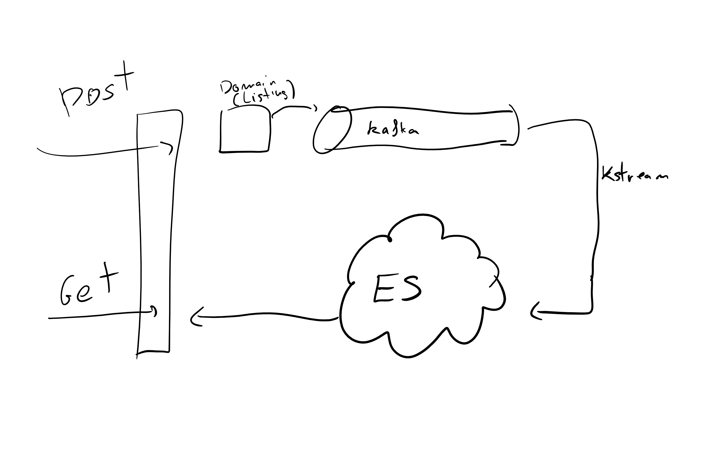

Functional Architecture Proof of Concept
========================================

Concept
-------

To design a proof of concept for a functional architecture, similar of what we can
find in some frontend applications. It's highly based on Flux/Redux architectures.

Components
----------

* [Handlers](src/main/java/io/kmruiz/fa/infrastructure/handlers) receive HTTP requests and delegates them
to a domain command or to a query.
* [Commands](src/main/java/io/kmruiz/fa/infrastructure/handlers/ListingHandler.java) Gets a domain object
from a Provider (a KTable), calls a domain function and materializes it into a stream.
* [Domain](src/main/java/io/kmruiz/fa/domain/listing/Listing.java) Does actual domain logic
* [Streams](src/main/java/io/kmruiz/fa/infrastructure/streams/ListingStoreMaterializer.java) Gets
information from different topics and distributes logic around the system. Those are similar to Reducers
in Redux.
* [Queries](src/main/java/io/kmruiz/fa/infrastructure/handlers/ListingHandler.java) Gets data from
materialized indexes and publishes it.
